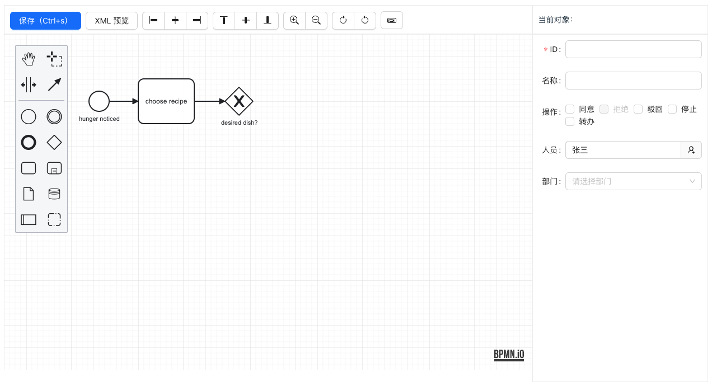

# Antd-Bpmn

一个基于 React + Ant.design + bpmn.js 编写的工作流高阶组件。

### 已完成功能
- [x] 基于 bpmn.js 的基础画图功能
- [x] XML 预览
- [x] XML 保存
- [x] 对齐方式：向右对齐，左右居中，向左对齐，向上对齐，上下居中，向下对齐
- [x] 放大、缩小
- [x] 撤销、重做
- [x] 快捷键

### AntdAdmin 介绍

AntdAdmin 是一个致力于 **中国信创** 产业的前端开源框架，其底层技术栈主要以 React + Ant.design 为主。AntdAdmin 开源（或者计划开源）的产品主要如下：

- antd-admin：一个基于 React + Ant.Design 的中（后）台 UI 框架（准备中...）。
- antd-crud：一个基于 React + Ant.Design 的增删改查高级组件（已开源：https://gitee.com/antdadmin/antd-crud ）。
- antd-bpmn：一个基于 React + Ant.Design 的工作流设计组件（已开源：https://gitee.com/antdadmin/antd-bpmn ）。
- antd-builder：一个基于 React + Ant.Design 的表单拖拽设计组件（准备中...）。

**AntdAdmin 交流 QQ 群：** 560291578
