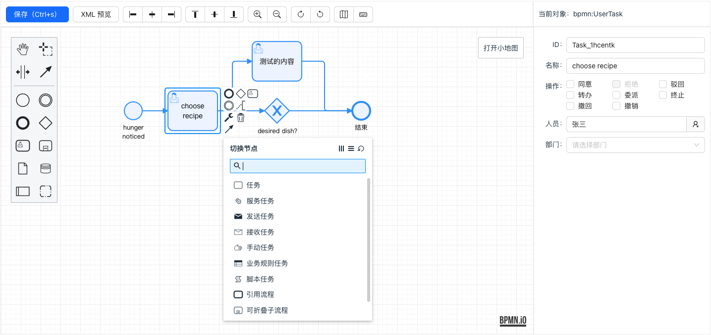

# Antd-bpmn

一个基于 React + Ant.design + bpmn.js 编写的工作流高阶组件。




### 已完成功能
- [x] 基于 bpmn.js 的基础画图功能
- [x] XML 预览
- [x] XML 保存
- [x] 对齐方式：向右对齐，左右居中，向左对齐，向上对齐，上下居中，向下对齐
- [x] 放大、缩小
- [x] 撤销、重做
- [x] 小地图、快捷键
- [x] 重写工具栏（更符合国人习惯）
- [x] 重写元素菜单（更符合国人习惯）
- [x] 属性面板的设置

### 如何使用

```tsx
function App() {
    const config: AntdBpmnConfig = {
        deptDataUrl: "/xxxx",
        onLoad: (url, set) => {
            console.log("onLoad", url)
            set([
                {value: 'dept1', label: '北京分公司'},
                {value: 'dept2', label: '上海分公司'},
                {value: 'dept3', label: '-- 上海研发部'},
            ])
        },

        onChooseAssignee: (set) => {
            set(Math.random(), "Michael");
        },
    };
    return <AntdBpmn config={config}/>;
}
```

**AntdBpmnConfig** 说明：

- deptDataUrl: 获取部门数据的 URL
- onLoad: 监听加载网络数据，数据加载完毕后通过第二个参数 `set` 方法来设置
- onChooseAssignee: 监听选择用户操作，选择用户后通过第二个参数 `set` 方法来设置


### 运行测试

```shell
git clone https://gitee.com/antdadmin/antd-bpmn.git

npm install
npm run dev
```

> Antd-bpmn 需要等第一个版本 release 后，才会发布到 NPM 仓库。

### AntdAdmin 介绍

AntdAdmin 是一个致力于 **中国信创** 产业的前端开源框架，其底层技术栈主要以 React + Ant.design 为主。AntdAdmin 开源（或者计划开源）的产品主要如下：


- antd-admin：一个基于 React + Ant.Design 的中（后）台 UI 框架（准备中...）。
- antd-crud：一个基于 React + Ant.Design 的增删改查高级组件（已开源：https://gitee.com/antdadmin/antd-crud ）。
- antd-bpmn：一个基于 React + Ant.Design 的工作流设计组件（已开源：https://gitee.com/antdadmin/antd-bpmn ）。
- antd-builder：一个基于 React + Ant.Design 的表单拖拽设计组件（准备中...）。


**AntdAdmin 交流 QQ 群：** 560291578
